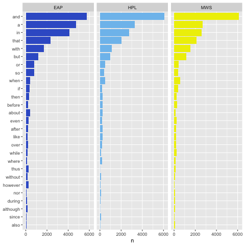
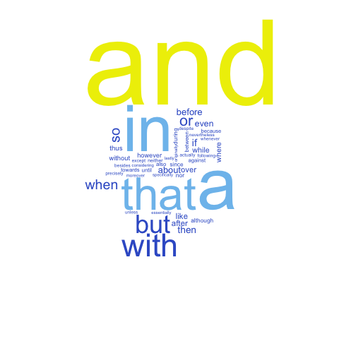
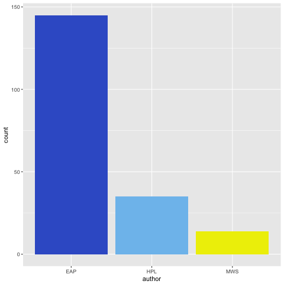
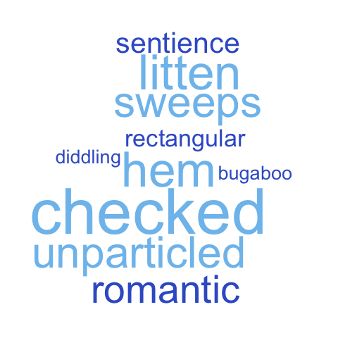
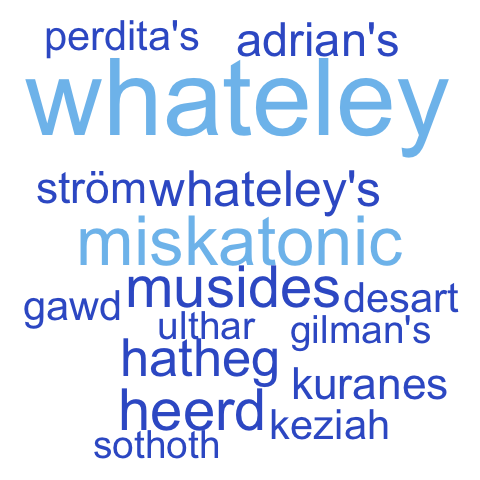

# Spring2018
# Project 1: SPOOKY Textual Analysis

----

### Project Description
This is the first and only *individual* (as opposed to *team*) this semester. 

Term: Spring 2018

+ Project title: Linguistic and Literary Significance
+ This project is conducted by [Jessica Zhang (zz2445)]
+ Project summary: When I searched Edgar Allan Poe, H.P. Lovecraft and Mary Shelley online, I learned that they all have made significant contributions to the realm of literature and the English language. Therefore, I would like to look at their literature to analyze their similarity and difference in writing.

### Learn about the three authors' linguistic and literary significance

First of all, I used the discourse_markers_alemany dataset from the lexicon package as reference. I matched the clean spooky data with this dataset.

I found that each author's use of discourse markers and three authors' total uses of discourse markers (wordcloud) were calculated.

From both graphs, three authors used similar numbers of discourse markers. "and" is the marker all of them used most frequently. Edgar Allan Poe used more "a" and "in" in text than the other authors. 

However, it's hard to conclude anything significant from this finding, so I decided to focus more on special literary aspects that we often can find in horror stories.

## Which author used more supernatural elements and horror vocabulary?

I thought it might be more interesting to look at each author's use of horror vocabulary in their text rather than grammar to analyze their styles. 

I found a horror words list from (http://www.enchantedlearning.com/wordlist/halloween.shtml), which contains 205 horror words. Then, I matched this words list with my dataset to find which author used more horror words in writing.

The graph shows that H.P. Lovecraft used more horror vocabulary than the other two authors. Edgar Allan Poe and Mary Shelley used almost same amount of horror vocabulary.

I also made a wordcloud of the most frequently used horror words by the three authors. It shows that "night" and "death" are used most frequently by the three authors. "strange", "dead", "fear" and "spirit" are the second most frequently used group of words.

## Poe's words

When I researched on the authors, I learned that Edgar Allan Poe had a great passion for language and for both revitalizing uncommon words and creating new ones. 

In the time since his passing, a great many words that Poe has used have entered the Oxford English Dictionary (OED). A further indication of Poe???s significance, both linguistic and literary, is the fact that there are a number of entries in the OED that are derived from Poe???s own name, most of which are used to describe fiction writing similar to his. 

Hence, I wanted to find if the other two authors have used any of Poe's words in their works. I found a list of Poe's words from (https://www.eapoe.org/papers/psblctrs/pl19741s.htm), which contains 329 Poe's words.

The graph above shows that H.P. Lovecraft used more Poe's words than Mary Shelley. 

From history, we know that Edgar Allan Poe was H.P. Lovecraft's most significant literary influence. This influence can be found in such works as his novella The Shadow Over Innsmouth where Lovecraft references Poe's story The Imp of the Perverse by name.

Here is a wordcloud showing the top frequently used Poe's words, which are "diddler", "manuscript", "goosetherumfoodle" and "hem".

## Three authors and the Oxford English Dictionary
We know that all of the three authors have made significant contributions to the English lexicon, thus I wanted to analyze how many non-OED words they used in writing and what are these words. 

I found a OED dictionary database from (https://github.com/dwyl/english-words/blob/master/words.txt), which contains 466,455 common English words. Then I matched my text data with this dictionary database, and analyzed on how many non-OED words each author used.

From the graph, H.P. Lovecraft used more non-OED words than the others, Edgar Allan Poe used more non-OED words than Mary Shelley, who only used a few non-OED words in her writings. 

This finding supports existed recognitions of three authors' language contributions. Both Edgar Allan Poe and Mary Shelley have many of their own creation of words included in the OED. H.P. Lovecraft is known for his unique nomenclature, which has inspired many generations of horror writers.

Here is a wordcloud of most frequently used non-OED words by the three authors. We see that most of these words are invented by the authors. These three author's unique nomenclature and contribution to the English language has inspired many generations of horror writers.

## Sentiment Analysis

For my own curiosity, I also applied a sentiment analysis using only the "sadness", "negative", "fear", "disgust" and "anger" from "The NRC Emotion Lexicon". I intended to compare each author's darkness/horror level with the negative sentiment and those four negative emotions.

From my result, it shows that Mary Shelley used more "negative", "sadness" and "anger" words than the other authors. There is no significant difference between Edgar Allan Poe and H.P. Lovecraft.
